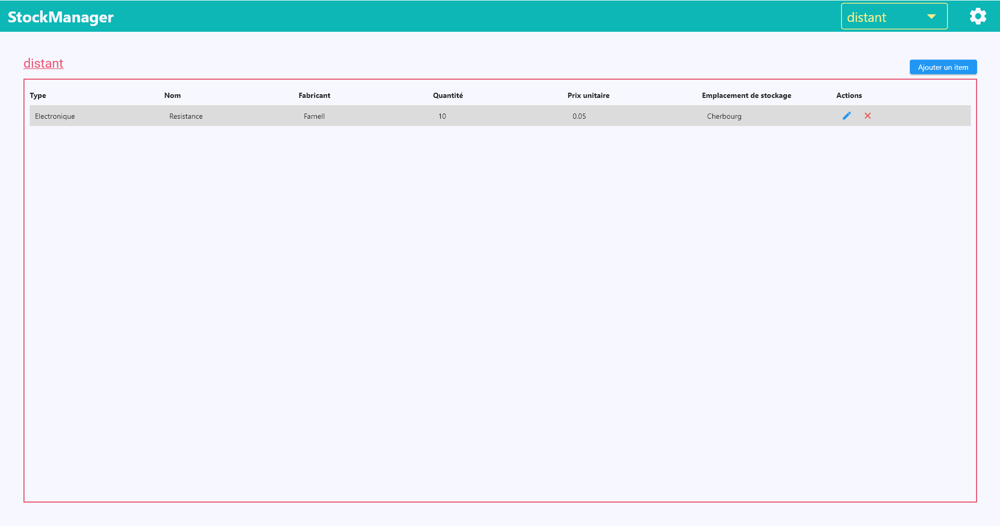
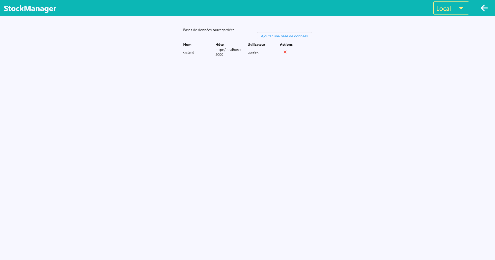

# Stock Manager

A lightweight and multiplatform solution to handle your inventory management on a small scale (typical diy maker scale)

## Description

From now, StockManager provides an easy to use interface to manage your own workshop's inventory. The software is still in active development and I'm listening to any suggestions to enhance both the interface and the functionalities.

## Current TODO:

- [ ] Remove "local database" capability and redirect to settings screen if no database added yet
- [ ] Add filters
- [ ] Add "search" field
- [ ] Look at possibilities to make the listing more personnalized (selectable columns)
- [ ] Think about tabbed nav between item's type => If you have ideas, I'm open !

For any other idea, I'm open to listening you !

## Screenshots:

These are screenshots from the real software

## Dependencies

- cupertino_icons: ^1.0.4
- provider: ^6.0.1
- shared_preferences: ^2.0.11
- sembast: ^3.1.1+1
- path_provider: ^2.0.8
- path: ^1.8.0
- sembast_web: ^2.0.1+1
- http: ^0.13.4

## Authors

- Fabien Aubret
  - Main developer
  - Mechanical engineer from Arts et Métiers school
  - Hobbyist and sometimes profesional developer (FullStack)
  - Contact: <fabien.aubret@gmail.com>

# License

 Ce(tte) œuvre est mise à disposition selon les termes de la <a rel="license" href="http://creativecommons.org/licenses/by-nc-sa/4.0/">Licence Creative Commons Attribution - Pas d’Utilisation Commerciale - Partage dans les Mêmes Conditions 4.0 International</a>.
